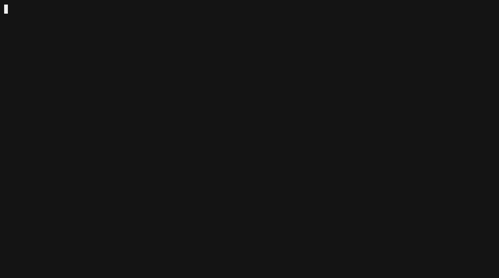

Markdown
# triage-trip 

> Autonomous CLI to pinpoint and patch regressions introduced by AI code assistants (Cursor, Copilot).



## The Problem
When you use AI coding assistants to refactor or draft features, errors often slip through:
- Subtle schema property renames (`userId` ➔ `user_id`).
- Dropped function arguments or breaking contract shifts.
- Regressions that aren't caught until 3 commits later.

Developers lose 30+ minutes digging through hundreds of lines of AI diffs trying to figure out which prompt broke the build.

## How It Works
`triage-trip` connects runtime failures back to their origin:
1. **Reads Local Git Stream:** Analyzes unstaged changes and recent commit diffs.
2. **Inspects Cursor Provenance:** Reads local IDE session SQLite databases (`state.vscdb`) to identify the exact human prompt that generated the regression.
3. **Isolates Semantic Shifts:** Determines contract and schema breaks.
4. **Interactive In-Memory Patching:** Applies clean unified diffs directly to your working tree via `git apply` with a single confirmation.

---

## Quick Start

Run instantly without global installation:

```bash
npx triage-trip triage "TypeError: Cannot read properties of undefined (reading 'toUpperCase')"
Or install globally:

Bash
npm install -g triage-trip
Environment Setup
Set your preferred LLM API key:

Bash
export ANTHROPIC_API_KEY="your-anthropic-key"
# or
export OPENAI_API_KEY="your-openai-key"
Usage
Diagnose an Error Trace
Bash
triage-trip triage "Cannot read properties of undefined (reading 'toUpperCase')"
Auto-Apply Patches Instantly
Skip the confirmation prompt to patch immediately:

Bash
triage-trip triage "ReferenceError: getUserProfile is not defined" --yes
Inspect More Commits
Bash
triage-trip triage "SyntaxError: Unexpected token" --commits 10
License
MIT


---

### Step 3: Commit and Publish

```bash
# Stage the updated doc and new GIF
git add README.md assets/demo.gif package.json bin/cli.js

# Commit
git commit -m "docs: rebrand to triage-trip with new demo gif"

# Push to your remote
git push origin main

# Publish live on npm
npm publish --access public


## Inspiration & Ecosystem

Large engineering organizations (like Uber with their internal autonomous debugging agents) have long relied on automated bisect and triage systems to catch regressions before they reach staging. 

However, existing enterprise tooling wasn't built for the AI code assistant era. When an LLM refactors multi-file repositories in Cursor or Copilot, conventional stack traces don't tell you which human prompt caused the contract shift. 

`triage-trip` bridges that gap for every developer: a zero-overhead local CLI that brings automated root-cause isolation, Cursor prompt provenance, and in-memory patching right to your terminal.

## Security & Privacy
- **Read-Only SQLite Access:** `triage-trip` reads local IDE databases (`state.vscdb`) in strict read-only mode (`readonly: true`). It never modifies editor settings or session files.
- **Direct LLM Communication:** Your repository context and diffs are sent directly to Anthropic or OpenAI using your own local environment API keys. No intermediate servers, telemetry trackers, or external logging daemons.

## Compatibility
- **IDEs:** Cursor (Full prompt provenance support via local Composer storage), VS Code / Windsurf (Git diff & contract triage)
- **Platforms:** macOS, Linux, Windows (WSL / PowerShell)
- **Runtime:** Node.js `>= 18.0.0`

## CLI Options

| Flag | Default | Description |
| :--- | :--- | :--- |
| `-c, --commits <num>` | `5` | Number of recent commits to inspect alongside unstaged working diffs |
| `-y, --yes` | `false` | Automatically apply the proposed patch without an interactive prompt |
| `-V, --version` | | Display current version |
| `-h, --help` | | Display help and usage options |

## Development

```bash
git clone [https://github.com/arules3/triage-trip.git](https://github.com/arules3/triage-trip.git)
cd triage-trip
npm install
npm link


## Current Status & Roadmap

### What's Working Today (`v0.1.0`)
- **Git Context Analysis:** Reads unstaged working tree diffs and recent commit logs.
- **Cursor Prompt Provenance:** Direct read-only extraction from local `state.vscdb` to link regressions to specific Composer prompts.
- **Root Cause Isolation:** LLM-assisted semantic contract shift detection.
- **Interactive Patching:** Clean, in-memory `git apply` with user confirmation prompts (`--yes` fallback).

### On the Horizon
- [ ] **Automated Test Verification:** Automatically run project test suites (`npm test`, `pytest`) to verify fixes before finalizing patches.
- [ ] **Expanded IDE Provenance:** Support for Windsurf (`cascade`), VS Code Copilot Chat, and Claude Code logs.
- [ ] **GitHub Action / CI Mode:** Comment directly on failed PR runs with the attributed prompt and proposed fix.
- [ ] **Deterministic AST Diffing:** Local offline schema diffing before LLM invocation to cut latency and token usage.